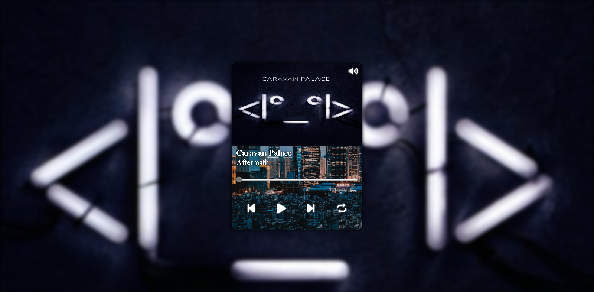

# Play Music
## Um player de música desenvolvido para estudos. Todos os direitos de música reservados para seus respectivos autores.

É necessário utilziar um servidor local para conseguir rodar o projeto, você pode usar a extenção <a href="https://marketplace.visualstudio.com/items?itemName=ritwickdey.LiveServer">Live Server </a>. O player utiliza de músicas que estão dentro da pasta local.

  
  
  
  

 

# Funcionalidades

  - Reproduzir músicas
  - Controles básicos de reprodução
  - Navegação por tab
  - Navegação por teclado

 

  
  
  <small>Obs: O teclado Virtual foi usado para representar o teclado físico.</small>

## feito com:

  
  
  

